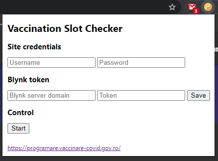

# vaccineSlotChecker

## Description
This is a Chrome extension used to automatically log into the https://programare.vaccinare-covid.gov.ro/ website with your valid
credentials and check for available vaccination slots in a specific (hardcoded - but changeable) vaccination center every 10 minutes.
- Checks for free vaccination slots every 10 minutes (so the local session doesn't expire)
- Logs out every 6 hours and logs back in (bypassing somehow magically the invisible reCaptcha) in order to refresh the server cookie which seemingly expires after 12 hours
- Sets the check time and slot count to 2 Virtual Pins onto a Blynk Server, from where, the data is read in a mobile application. (Blynk server can be official one or custom one, all we need to set is the server hostname and 'device' token.)
- The Blynk app is configured so that it notifies all app users (who have access to the project) via a push notification with the available vaccination slots

This was created because of 3 reasons:
1. Medics & other interested people don't get notified when additional slots are available again
2. To learn & mess around with Chrome Extensions
3. Why not? :)

# Screenshots & technical caveats

### Clone this repo & go to Chrome -> Extension and load it in via the 'Load unpacked' button. Developer mode needs to be on.

### These are the extension details & permissions needed

### You can click on the extension icon anytime, but the popup panel will only show up when we're on the https://programare.vaccinare-covid.gov.ro/ webpage.
- There's no reason for it to be accessible anywhere else.

### We add the username & password with which we log normally in and our blynk server and token.
- The Pause / Start button is in order to pause the extension. Sometimes you don't want it to run.
- All changes are saved to a cookie when you press the Save button.

### The script automatically tries log in
- It attempts to fill in the form data by manipulating the __ __ngContext__ __ via an injected script.
- It attempts to fool the form so that the data becomes valid & attempts to 'click' the log in button.
- Cosmetic validation errors appear on the form, but they don't seem to matter.
- It seemingly bypasses Google's invisible reCaptcha validation. Neat!

### Success! We're logged in, so now, we can use the API call to search for free vaccination slots.
- The script checks for slots every 10 minutes & sends the data to a Blynk server from where tha data can be read easily via the Blynk app.
- 10 minutes is enough to keep the client session valid & not too frequent to create problems on the server. ***Don't be an ass!***
- The script logs out every 6 hours, after which the other context script attempts to log back in again. This way we refresh the server session which normally expires after 12 hours.

---

### You'll most probably get an error after 10 minutes, if you're using a Blynk server that only runs on __http__, not __https__.
- If you are using the official Blynk cloud server, then disregard the following 4 screenshots & jump to the end. Otherwise, keep on reading:
- The reason we're getting this error, is because the webpage is served via HTTPS, but we're making a request to a non-secure Blynk server.

### Click on the 'Not secure' button on the left of the URL & go to __Site settings__

### Scroll down to __Insecure content__ and change it to __Allow__ & then save the settings and reload the page.

### The script will run & after 10 minutes, instead of an error, only a warning will appear.

---

### Screenshot of the Blynk App used to see the status of the available vaccination slots.

